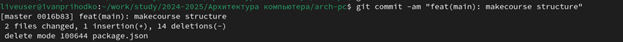

---
## Front matter
title: "Лабораторная работа №2"
subtitle: "Система контроля версии git"
author: "Приходько Иван Иванович"

## Generic otions
lang: ru-RU
toc-title: "Содержание"

## Bibliography
bibliography: bib/cite.bib
csl: pandoc/csl/gost-r-7-0-5-2008-numeric.csl

## Pdf output format
toc: true # Table of contents
toc-depth: 2
lof: true # List of figures
lot: true # List of tables
fontsize: 12pt
linestretch: 1.5
papersize: a4
documentclass: scrreprt
## I18n polyglossia
polyglossia-lang:
  name: russian
  options:
	- spelling=modern
	- babelshorthands=true
polyglossia-otherlangs:
  name: english
## I18n babel
babel-lang: russian
babel-otherlangs: english
## Fonts
mainfont: IBM Plex Serif
romanfont: IBM Plex Serif
sansfont: IBM Plex Sans
monofont: IBM Plex Mono
mathfont: STIX Two Math
mainfontoptions: Ligatures=Common,Ligatures=TeX,Scale=0.94
romanfontoptions: Ligatures=Common,Ligatures=TeX,Scale=0.94
sansfontoptions: Ligatures=Common,Ligatures=TeX,Scale=MatchLowercase,Scale=0.94
monofontoptions: Scale=MatchLowercase,Scale=0.94,FakeStretch=0.9
mathfontoptions:
## Biblatex
biblatex: true
biblio-style: "gost-numeric"
biblatexoptions:
  - parentracker=true
  - backend=biber
  - hyperref=auto
  - language=auto
  - autolang=other*
  - citestyle=gost-numeric
## Pandoc-crossref LaTeX customization
figureTitle: "Рис."
tableTitle: "Таблица"
listingTitle: "Листинг"
lofTitle: "Список иллюстраций"
lotTitle: "Список таблиц"
lolTitle: "Листинги"
## Misc options
indent: true
header-includes:
  - \usepackage{indentfirst}
  - \usepackage{float} # keep figures where there are in the text
  - \floatplacement{figure}{H} # keep figures where there are in the text
---

# Цель работы

Приобрести навыки по работе с системой git и научиться пользоваться онлайн платформой GitHub.

# Выполнение лабораторной работы

Предварительно настроим git (см. рис. 1)

Предварительно настроим git (см. рис. 1)

Теперь введем команду, чтобы выводить сообщения в кодировке utf8 (см. рис. 2)

Зададим имя начальной ветки “master” (см. рис. 3)

Теперь укажем git автоматически конвертировать CRLF окончания строк в LF (см. рис. 4)

Теперь выполним команду, чтобы терминал печатал предупреждение в случае, если преобразования будут необратимы (см. рис. 5)

Для того, чтобы сервер мог идентифицировать пользователя, необходимо сгенерировать несколько ssh ключей. Начнем с генерации открытого ключа. Для этого мы введем следующую команду, указав имя пользователя и его адрес электронной почты в качестве аргумента (см. рис. 6)

Зайдём на Github и перейдем в настройки (https://github.com/SunHermit67) (см. рис. 7)

Находим раздел SSH and GPG keys и нажимаем New SSH key (см. рис. 8)

Теперь выведем и вставим ключ в Github (см. рис. 9 и 10)

Организуем рабочее пространство, создав папку “Архитектура компьютера” (см. рис. 11)
 

Создадим репозиторий на основе шаблона https://github.com/yamadharma/course-directory-student-template (см. рис. 12 и 13)

Теперь перейдем в папку (см. рис. 14)

Теперь перейдем к клонированию, для этого воспользуемся командой git clone, в аргументе указав ссылку на репозиторий (см. рис. 15 и 16). 

Теперь зайдем в нужный каталог (см. рис. 17)

Удалим с помощью команды "rm" лишний файл (см. рис. 18)

Теперь создадим файл COURSE (см. рис. 19)

Теперь отправим файлы на сервер (см. рис. 20-22)

Теперь проверяем (см. рис. 23 и 24)

Всё совпало.

# Задания для сомастоятельной работы

Теперь приступим к выполнению самостоятельной работы.

Создадим все необходимые файлы, скопируем предыдущий отчет и отправим на сервер (см. рис. 25)

Как видим всё получилось (см. рис 28)

# Выводы

В результате выполнения лабораторной работы появились практические навыки работы с системой контроля версий Git, была произведена её первоначальная настройка в linux. Было изучено, как создавать репозитории, сохранять изменения и добавлять к ним комментарии, а также как выгружать файлы на сервер. Были приобретены навыки работы с платформой GitHub

