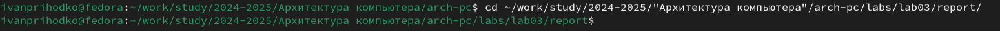
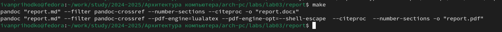

---
## Front matter
title: "Лабораторная работа №3"
subtitle: "Язык раметки Markdown"
author: "Приходько Иван Иванович"

## Generic otions
lang: ru-RU
toc-title: "Содержание"

## Bibliography
bibliography: bib/cite.bib
csl: pandoc/csl/gost-r-7-0-5-2008-numeric.csl

## Pdf output format
toc: true # Table of contents
toc-depth: 2
lof: true # List of figures
lot: true # List of tables
fontsize: 12pt
linestretch: 1.5
papersize: a4
documentclass: scrreprt
## I18n polyglossia
polyglossia-lang:
  name: russian
  options:
	- spelling=modern
	- babelshorthands=true
polyglossia-otherlangs:
  name: english
## I18n babel
babel-lang: russian
babel-otherlangs: english
## Fonts
mainfont: IBM Plex Serif
romanfont: IBM Plex Serif
sansfont: IBM Plex Sans
monofont: IBM Plex Mono
mathfont: STIX Two Math
mainfontoptions: Ligatures=Common,Ligatures=TeX,Scale=0.94
romanfontoptions: Ligatures=Common,Ligatures=TeX,Scale=0.94
sansfontoptions: Ligatures=Common,Ligatures=TeX,Scale=MatchLowercase,Scale=0.94
monofontoptions: Scale=MatchLowercase,Scale=0.94,FakeStretch=0.9
mathfontoptions:
## Biblatex
biblatex: true
biblio-style: "gost-numeric"
biblatexoptions:
  - parentracker=true
  - backend=biber
  - hyperref=auto
  - language=auto
  - autolang=other*
  - citestyle=gost-numeric
## Pandoc-crossref LaTeX customization
figureTitle: "Рис."
tableTitle: "Таблица"
listingTitle: "Листинг"
lofTitle: "Список иллюстраций"
lotTitle: "Список таблиц"
lolTitle: "Листинги"
## Misc options
indent: true
header-includes:
  - \usepackage{indentfirst}
  - \usepackage{float} # keep figures where there are in the text
  - \floatplacement{figure}{H} # keep figures where there are in the text
---

# Цель работы

Здесь приводится формулировка цели лабораторной работы. Формулировки
цели для каждой лабораторной работы приведены в методических
указаниях.

Цель данного шаблона --- максимально упростить подготовку отчётов по
лабораторным работам.  Модифицируя данный шаблон, студенты смогут без
труда подготовить отчёт по лабораторным работам, а также познакомиться
с основными возможностями разметки Markdown.

# Выполнение лабораторной работы

Для начала переместимся в рабочий каталог (см. рис. 2.1)

Синхронизируем файлы на компьютере при помощи команды git pull (см. рис. 2.2)

Перейдем в рабочий каталог третьей лабораторной работы (см. рис. 2.3)

Теперь скомпилируем шаблон отчета при помощи команды make (см. рис. 2.4)

Проверим создались ли файлы (см. рис. 2.5 - 2.7)

Попробуем все это удалить (см. рис. 2.8)

Проверим, сработала ли команда (см. рис. 2.9)

Откровем файл report.md при помощи редактора degit (см. рис. 2.10)

Посмотрим как выглядит файл (см. рис. 2.11)

После заполнения отчета, скомпилируем готовый отчет при помощи команды make (см. рис. 2.12)

Перейдем в рабочий каталог (см. рис. 2.13)

Осталось только отправить файлы на github (см. рис. 2.14-2.15)

# Выполнения задания для самостоятельной работы

Нам нужно переделать вторую лабораторную работу в формате markdown, для начала перейдем в каталог второй лабораторной работы (см. рис. 3.1)

Откроем файл при помощи degit (см. рис. 3.2)

Заполним титульную страницу (см. рис. 3.3)

Заполним цель и выполнение работы (см. рис. 3.4)

Запишем задания для самостоятельной работы (см. рис. 3.5)

Заполним выводы (см. рис. 3.6)

Поместим скриншоты в отдельную папку (см. рис. 3.7)

Соберем отчет (см. рис. 3.8)

Зайдем в рабочий каталог (см. рис. 3.9)

Отправим все файлы на github (см. рис. 3.10 - 3.11)

# Выводы

В результате выполнение лабораторной работы были получены знания для работы с языком разметки markdown, также были заполнены две лабораторные работы.
