---
## Front matter
title: "Создание и процесс обработки на языке ассемблера NASM"
subtitle: "Лабораторная работа №4"
author: "Приходько Иван Иванович"

## Generic otions
lang: ru-RU
toc-title: "Содержание"

## Bibliography
bibliography: bib/cite.bib
csl: pandoc/csl/gost-r-7-0-5-2008-numeric.csl

## Pdf output format
toc: true # Table of contents
toc-depth: 2
lof: true # List of figures
lot: true # List of tables
fontsize: 12pt
linestretch: 1.5
papersize: a4
documentclass: scrreprt
## I18n polyglossia
polyglossia-lang:
  name: russian
  options:
	- spelling=modern
	- babelshorthands=true
polyglossia-otherlangs:
  name: english
## I18n babel
babel-lang: russian
babel-otherlangs: english
## Fonts
mainfont: IBM Plex Serif
romanfont: IBM Plex Serif
sansfont: IBM Plex Sans
monofont: IBM Plex Mono
mathfont: STIX Two Math
mainfontoptions: Ligatures=Common,Ligatures=TeX,Scale=0.94
romanfontoptions: Ligatures=Common,Ligatures=TeX,Scale=0.94
sansfontoptions: Ligatures=Common,Ligatures=TeX,Scale=MatchLowercase,Scale=0.94
monofontoptions: Scale=MatchLowercase,Scale=0.94,FakeStretch=0.9
mathfontoptions:
## Biblatex
biblatex: true
biblio-style: "gost-numeric"
biblatexoptions:
  - parentracker=true
  - backend=biber
  - hyperref=auto
  - language=auto
  - autolang=other*
  - citestyle=gost-numeric
## Pandoc-crossref LaTeX customization
figureTitle: "Рис."
tableTitle: "Таблица"
listingTitle: "Листинг"
lofTitle: "Список иллюстраций"
lotTitle: "Список таблиц"
lolTitle: "Листинги"
## Misc options
indent: true
header-includes:
  - \usepackage{indentfirst}
  - \usepackage{float} # keep figures where there are in the text
  - \floatplacement{figure}{H} # keep figures where there are in the text
---

# Цель работы

Научится писать базовую программу на языке ассемблера NASM, компилировать их в объектные файлы и собирать из них  готовые к запуску программы.

# Выполнение лабораторной работы

Для начала перейдем в рабочий каталог (рис. 2.1).

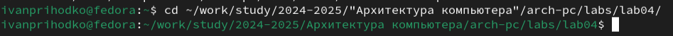

Созаддим файл hello с расширением asm, чтобы писать в нем код (рис. 2.2).

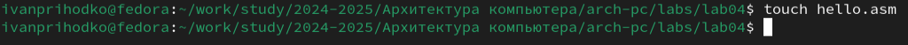

Теперь откроем данный файл и вставим в него данный код (рис. 2.3 и 2.4).

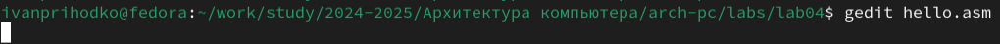

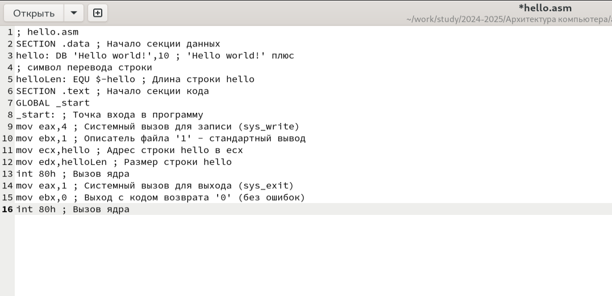

Теперь превративм наш файл в объектный (рис. 2.5).

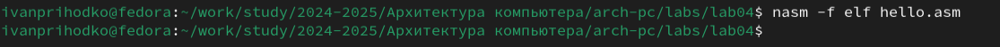

Проверим (рис. 2.6).

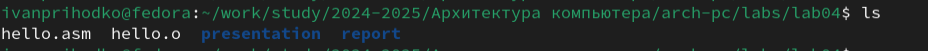

Используем полный вариант команды NASM (рис. 2.7).

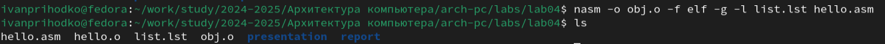

Используем компоновщик ld для создания исполняемого файла (рис. 2.8).

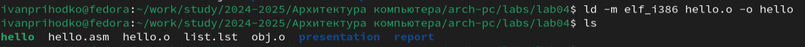

Теперь соберем файл obj.o в main (рис. 2.9).

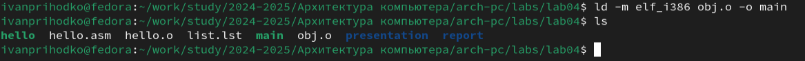

Запустим файл (рис. 2.10).

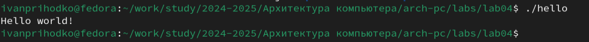

# Выполнение задания для самостоятельной работы

Скопируем файл hello.asm в рабочий каталог (рис. 3.1).

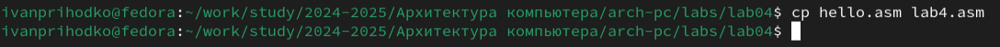

Внесем изменения в файл и спишем вместо Hello world! свое имя и фамилию (рис. 3.2 и 3.3).

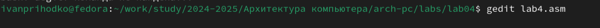

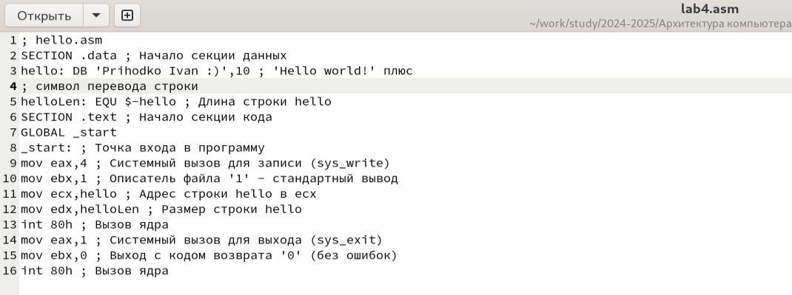

Повторим действия также как и с hello.asm. Скомпилируем файл, соберем его в объектный и запустим (рис. 3.4).

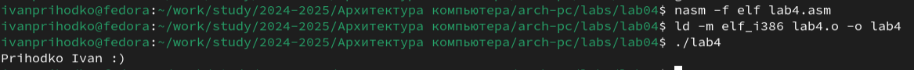

Не забудем отправить все на Github (рис. 3.5).

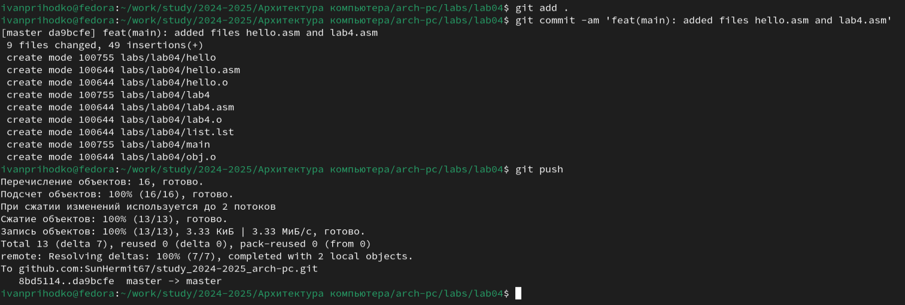

# Выводы

В результате проделанной работы появилось понимание того, как нужно создавать исполняемый файл на языке ассемблера.

