---
## Front matter
title: "Лабораторная работа №5"
subtitle: "Основы работы с MC (Midnight Commnader), структура программы на языке ассемблера NASM, системные вызовы в OC GNU Linux"
author: "Приходько Иван Иванович"

## Generic otions
lang: ru-RU
toc-title: "Содержание"

## Bibliography
bibliography: bib/cite.bib
csl: pandoc/csl/gost-r-7-0-5-2008-numeric.csl

## Pdf output format
toc: true # Table of contents
toc-depth: 2
lof: true # List of figures
lot: true # List of tables
fontsize: 12pt
linestretch: 1.5
papersize: a4
documentclass: scrreprt
## I18n polyglossia
polyglossia-lang:
  name: russian
  options:
	- spelling=modern
	- babelshorthands=true
polyglossia-otherlangs:
  name: english
## I18n babel
babel-lang: russian
babel-otherlangs: english
## Fonts
mainfont: IBM Plex Serif
romanfont: IBM Plex Serif
sansfont: IBM Plex Sans
monofont: IBM Plex Mono
mathfont: STIX Two Math
mainfontoptions: Ligatures=Common,Ligatures=TeX,Scale=0.94
romanfontoptions: Ligatures=Common,Ligatures=TeX,Scale=0.94
sansfontoptions: Ligatures=Common,Ligatures=TeX,Scale=MatchLowercase,Scale=0.94
monofontoptions: Scale=MatchLowercase,Scale=0.94,FakeStretch=0.9
mathfontoptions:
## Biblatex
biblatex: true
biblio-style: "gost-numeric"
biblatexoptions:
  - parentracker=true
  - backend=biber
  - hyperref=auto
  - language=auto
  - autolang=other*
  - citestyle=gost-numeric
## Pandoc-crossref LaTeX customization
figureTitle: "Рис."
tableTitle: "Таблица"
listingTitle: "Листинг"
lofTitle: "Список иллюстраций"
lotTitle: "Список таблиц"
lolTitle: "Листинги"
## Misc options
indent: true
header-includes:
  - \usepackage{indentfirst}
  - \usepackage{float} # keep figures where there are in the text
  - \floatplacement{figure}{H} # keep figures where there are in the text
---

# Цель работы

Ознакомиться с программой Midnight commander и освоить написание программ на языке ассемблера с помощью инструкций mov и int

# Выполнение лабораторной работы

Для начала запустим Midnight Commander (рис. 2.1).

Мы увидим такой интерфейс (рис. 2.2).

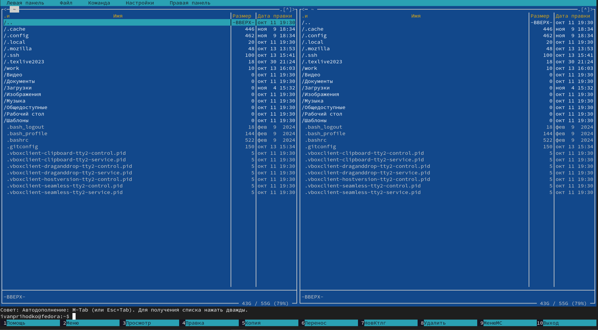

Перейдем в каталог arch-pc (рис. 2.3).

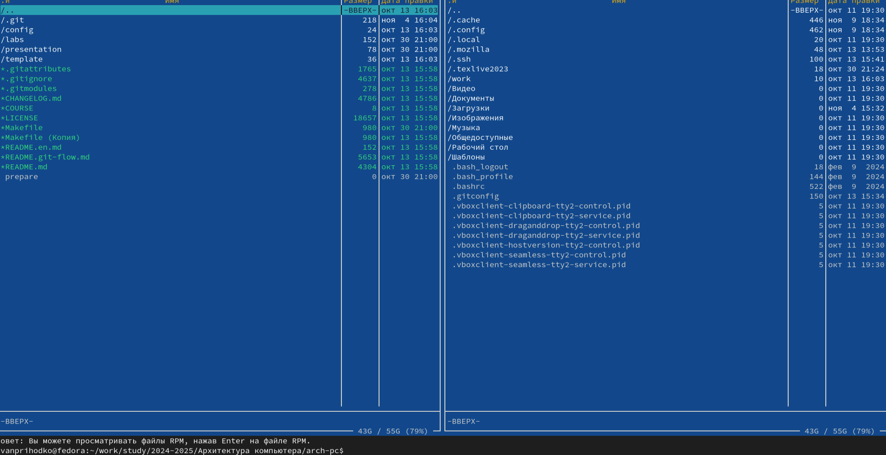

Создадим с помощью touch файл lab5-1.asm (рис. 2.4).

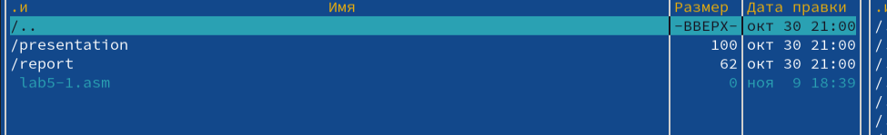

Вставим в него следующий код (рис. 2.5).

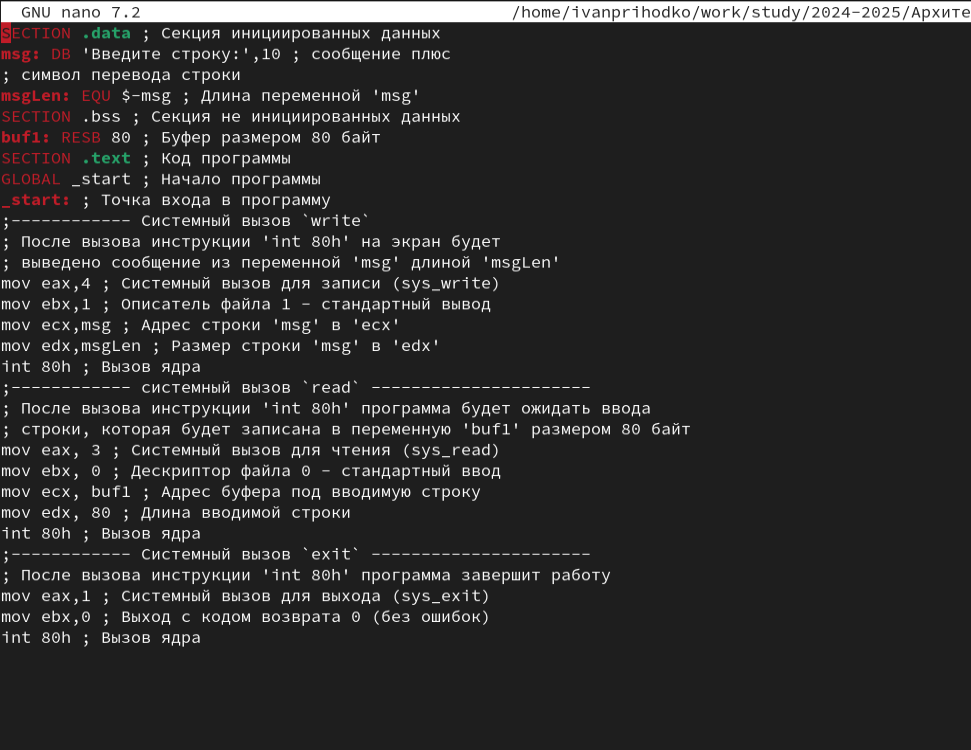

Теперь скомпилируем и соберем его (рис. 2.6 и 2.7).

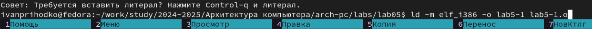

Запустим его (рис. 2.8 и 2.9).

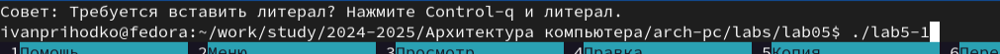

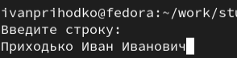

Теперь скачаем файл in_out.asm и откроем папку с ним в правой панели (рис. 2.10).

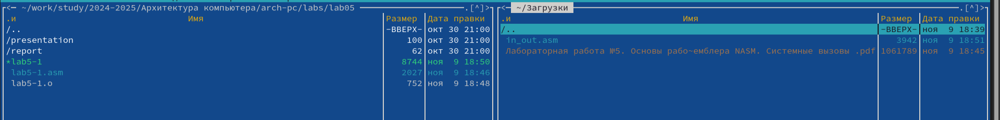

Скопируем его в рабочую область (рис. 2.11).

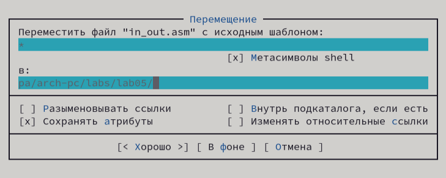

Теперь сделаем копию файла lab5-1.asm и назовём копию lab5-2.asm (рис. 2.12).

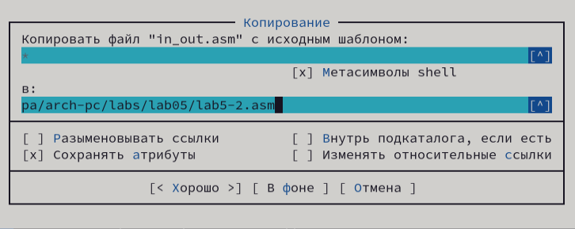

Теперь наша папка выглядит так (рис. 2.13).

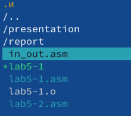

Напишем в файл lab5-2.asm следующий код(рис. 2.14).

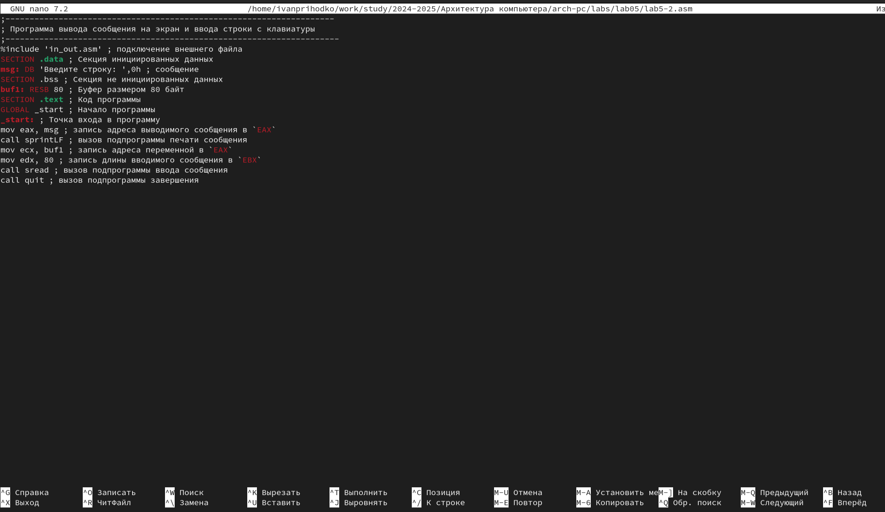

Теперь скомпилируем, соберем и запустим его (рис. 2.15).

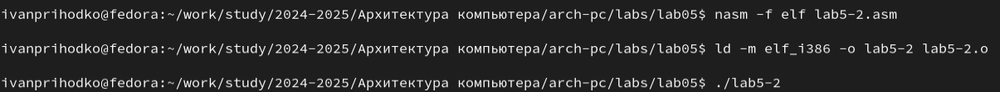

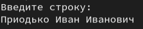

 Попробуем теперь вместо команды sprintLF использовать просто команду sprint (рис. 2.17).

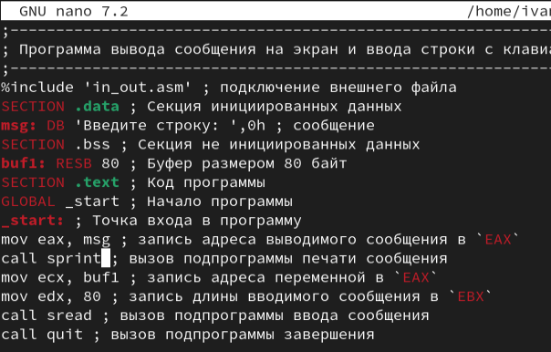

Теперь запустим его (рис. 2.18).

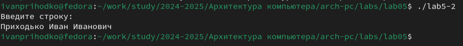

# Выполнение задания для самостоятельной работы

Создадим копию файла lab5-1.asm (рис. 3.1).

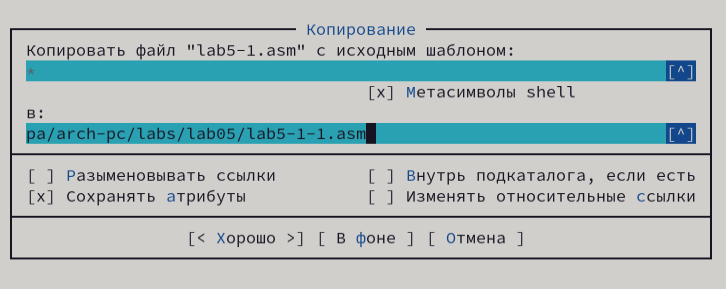

Изменим копию так, чтобы она выводила тот текст, который получила на ввод (рис. 3.2).

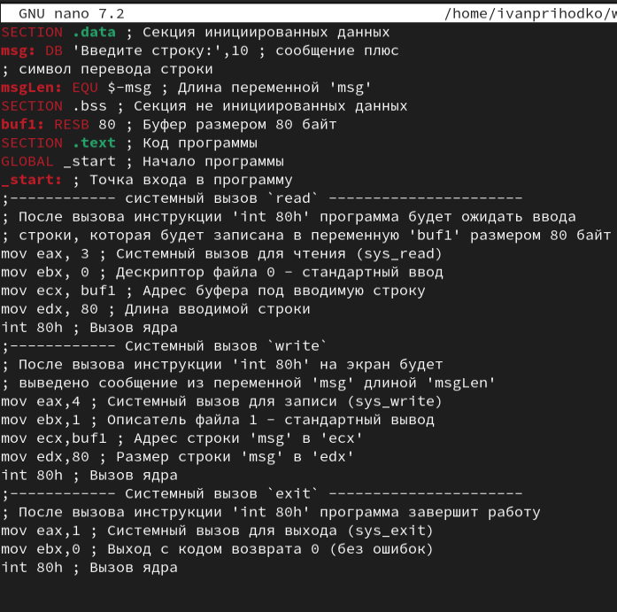

Теперь создадим исполняем файл и и запустим его (рис. 3.3).

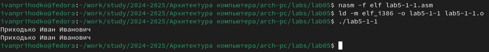

Создадим копию файла lab5-2.asm (рис. 3.4).

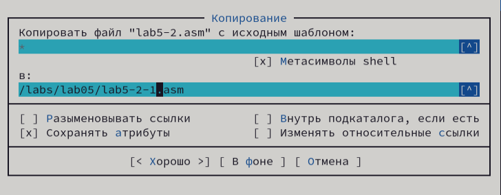

Теперь сделаем так, чтобы этот код также выводил тот текст, что получит на ввод. Для этого перед последней строкой добавим строчку, которая записывает в eax адрес buf1, а также строчку, которая вызывает подпрограмму sprintLF (рис. 3.5).

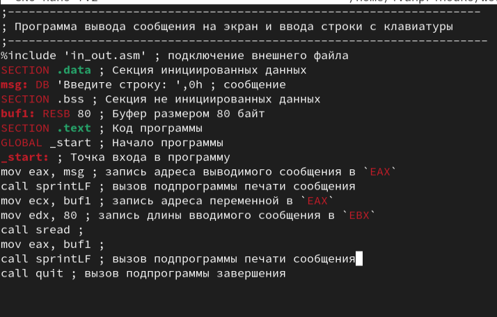

Теперь запустим программу и убедимся, что она работает (рис. 3.6).

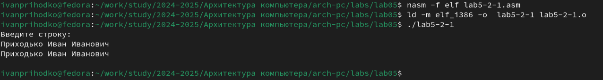

# Выводы

В результате выполнения работы были получены навыки работы с Midnight commander, а также навыки написания простых программ ввода-вывода на языке ассемблера

