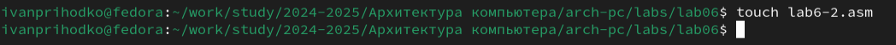

---
## Front matter
title: "Арифметические операции в NASM"
subtitle: "Лабораторная работа №6"
author: "Приходько Иван Иванович"

## Generic otions
lang: ru-RU
toc-title: "Содержание"

## Bibliography
bibliography: bib/cite.bib
csl: pandoc/csl/gost-r-7-0-5-2008-numeric.csl

## Pdf output format
toc: true # Table of contents
toc-depth: 2
lof: true # List of figures
lot: true # List of tables
fontsize: 12pt
linestretch: 1.5
papersize: a4
documentclass: scrreprt
## I18n polyglossia
polyglossia-lang:
  name: russian
  options:
	- spelling=modern
	- babelshorthands=true
polyglossia-otherlangs:
  name: english
## I18n babel
babel-lang: russian
babel-otherlangs: english
## Fonts
mainfont: IBM Plex Serif
romanfont: IBM Plex Serif
sansfont: IBM Plex Sans
monofont: IBM Plex Mono
mathfont: STIX Two Math
mainfontoptions: Ligatures=Common,Ligatures=TeX,Scale=0.94
romanfontoptions: Ligatures=Common,Ligatures=TeX,Scale=0.94
sansfontoptions: Ligatures=Common,Ligatures=TeX,Scale=MatchLowercase,Scale=0.94
monofontoptions: Scale=MatchLowercase,Scale=0.94,FakeStretch=0.9
mathfontoptions:
## Biblatex
biblatex: true
biblio-style: "gost-numeric"
biblatexoptions:
  - parentracker=true
  - backend=biber
  - hyperref=auto
  - language=auto
  - autolang=other*
  - citestyle=gost-numeric
## Pandoc-crossref LaTeX customization
figureTitle: "Рис."
tableTitle: "Таблица"
listingTitle: "Листинг"
lofTitle: "Список иллюстраций"
lotTitle: "Список таблиц"
lolTitle: "Листинги"
## Misc options
indent: true
header-includes:
  - \usepackage{indentfirst}
  - \usepackage{float} # keep figures where there are in the text
  - \floatplacement{figure}{H} # keep figures where there are in the text
---

# Цель работы

Познакомиться с базовыми инструкциями языка Ассемблер, отвечающими за основные арифметические операции.

# Выполнение лабораторной работы

Для начала выполнения лабораторной работы необходимо создать файл lab6-1.asm (рис. 2.1).

Вставим в наш созданный файл код из листинга 6.1 (рис. 2.2).

Перед начало работы скопируем файл in_out.asm для корректной работы (рис. 2.3).

Соберем и запустим программу (рис. 2.4 и 2.5).

Нам выводит символ j, однако это неправильный вывод. Наша цель - сложить 6 и 4, и получить в выводе число 10. Попробуем изменить наш файл (рис. 2.6).

Теперь соберем и запустим файл заново (рис. 2.7).

Когда мы вызываем команду sprintLF, она выводит не число 10, а символ с номером 10. Символ под номером 10 это символ перевода строки. Теперь создадим второй файл под названием lab6-2.asm (рис. 2.8).

Теперь вставим в него код из листинга 6.2 (рис. 2.9).

Соберем и запустим файл (рис. 2.10).

Мы видим число 106. Так как цифры в коде указаны в кавычках, мы складываем их коды (54 и 52 в сумме дают 106). Изменим файл (рис. 2.11).

Теперь запустим файл (рис. 2.12).

Создадим третий файл, вставим в него код из листинга 6.3, соберем и запустим его (рис. 2.13-2.15).

Полученный результат совпадает с результатом, указанным в лабораторной работе. Теперь изменим файл так, чтобы он вычислял значение выражения (4*6+2)/5. (рис. 2.16).

Соберем и запустим его (рис. 2.17).

Теперь создадим файл variant.asm для вычисления варианта самостоятельной работы и вставим в него код из листинга 6.4 (рис. 2.18 и 2.19).

Запишем номер своего студенческого и узнаем номер варианта (рис. 2.20).

Теперь отвечу на предложенные в лабораторной работе вопросы:

1. Какие строки листинга 6.4 отвечают за вывод на экран сообщения ‘Ваш вариант:’?

За это отвечает строчка call sprint в связке с mov eax,rem

2. Для чего используется следующие инструкции?

mov ecx, x

mov edx, 80

call sread

Эти строки используются для того, чтобы записать данные в переменную x

3. Для чего используется инструкция “call atoi”?

Для преобразования ASCII кода в число

4. Какие строки листинга 6.4 отвечают за вычисления варианта?

div ebx - для деления

inc edx - для прибавки единицы

5. В какой регистр записывается остаток от деления при выполнении инструкции “div ebx”?

В регистр edx

6. Для чего используется инструкция “inc edx”?

Для увеличения значения регистра edx на единицу

7. Какие строки листинга 6.4 отвечают за вывод на экран результата вычислений?

mov eax,edx - для переноса значение регистра edx в eax

call iprintLF - выводит значение из регистра eax

# Задание для самостоятельной работы

Теперь в качестве самостоятельной работы напишем код программы для вычисления выражения в варианте 6: (x^3)/2+1 (рис. 3.1).

mov eax, msg

call sprintLF

mov eax, msg2

call sprintLF

Эти строчки отвечают за вывод сообщений пользователю

mov ecx, x

mov edx, 80

call sread

Эти строчки отвечают за считывание х у пользователя

mov eax, x

call atoi

Эти строчки конвертируют все строки в десятичные числа

push eax

mov ebx, eax

mul ebx

mov ebx, eax

pop eax

mul ebx

Эти строчки отвечают за счет x^3, сначала вы запоминаем оригинальное значение х, потом считает x^2, потом умножаем х на x^2

mov ebx, 2

div ebx

add eax, 1

Эти строчки отвечают за деление на 2 и прибавку единицы

Теперь соберем и запустим код (рис. 3.3).

Все правильно, проведем еще несколько тестов (рис. 3.4).

# Выводы

В результате выполнения лабораторной работы было получено представление о том, какие арифметические операции есть в языке Ассемблера, и как они работают. Были написаны программы, использующие в себе операции сложения, вычитания, умножения и деления.

