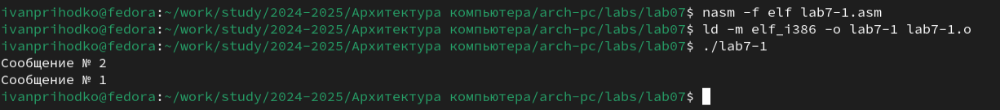

---
## Front matter
title: "Команды безусловного и условного переходов в Nasm. Программирование ветвлений."
subtitle: "Лабораторная работа №7"
author: "Приходько Иван Иванович"

## Generic otions
lang: ru-RU
toc-title: "Содержание"

## Bibliography
bibliography: bib/cite.bib
csl: pandoc/csl/gost-r-7-0-5-2008-numeric.csl

## Pdf output format
toc: true # Table of contents
toc-depth: 2
lof: true # List of figures
lot: true # List of tables
fontsize: 12pt
linestretch: 1.5
papersize: a4
documentclass: scrreprt
## I18n polyglossia
polyglossia-lang:
  name: russian
  options:
	- spelling=modern
	- babelshorthands=true
polyglossia-otherlangs:
  name: english
## I18n babel
babel-lang: russian
babel-otherlangs: english
## Fonts
mainfont: IBM Plex Serif
romanfont: IBM Plex Serif
sansfont: IBM Plex Sans
monofont: IBM Plex Mono
mathfont: STIX Two Math
mainfontoptions: Ligatures=Common,Ligatures=TeX,Scale=0.94
romanfontoptions: Ligatures=Common,Ligatures=TeX,Scale=0.94
sansfontoptions: Ligatures=Common,Ligatures=TeX,Scale=MatchLowercase,Scale=0.94
monofontoptions: Scale=MatchLowercase,Scale=0.94,FakeStretch=0.9
mathfontoptions:
## Biblatex
biblatex: true
biblio-style: "gost-numeric"
biblatexoptions:
  - parentracker=true
  - backend=biber
  - hyperref=auto
  - language=auto
  - autolang=other*
  - citestyle=gost-numeric
## Pandoc-crossref LaTeX customization
figureTitle: "Рис."
tableTitle: "Таблица"
listingTitle: "Листинг"
lofTitle: "Список иллюстраций"
lotTitle: "Список таблиц"
lolTitle: "Листинги"
## Misc options
indent: true
header-includes:
  - \usepackage{indentfirst}
  - \usepackage{float} # keep figures where there are in the text
  - \floatplacement{figure}{H} # keep figures where there are in the text
---

# Цель работы

Понять принцип работы условных и безусловных переходов в Ассемблере и научиться писать программы с командами, отвечающими за переходы. Научиться работать с файлами листинга и уметь их читать.

# Выполнение лабораторной работы

Для начала выполнения лабораторной работы необходимо создать файл lab7-1.asm (рис. 2.1).

Вставим в него код из листинга 7.1 (рис. 2.2).

Скопируем файл in_out.asm из рабочей директории прошлой лабораторной работы (рис. 2.3).

Соберем и запустим (рис. 2.4).

Изменим файл lab7-1.asm согласно листингу 7.2 (рис. 2.5).

Повторно соберем и запустим (рис. 2.6).

Теперь сделаем так, чтобы код выводил сообщения в обратном порядке, для этого внесём в код следующие изменения (рис. 2.7).

Запустим (рис. 2.8).

Теперь создадим файл lab7-2.asm (рис. 2.9).

Вставим код из листинга 7.3 в файл lab7-2.asm (рис. 2.10).

Соберем и запустим (рис. 2.11).

Теперь попробуем создать файл листинга при сборке файла lab7-2.asm (рис. 2.12).

Открыв его, мы видим следующую картину (рис. 2.13).

Наша программа находится ниже (рис. 2.14).

Разберём несколько строк файла листинга:

1. Строка под номером 14 перемещает содержимое msg1 в регистр eax. Адрес указывается сразу после номера. Следом идёт машинный код, который представляет собой исходную ассемблированную строку в виде шестнадцатиричной системы. Далее идёт исходный код

2. 15-ая строка отвечает за вызов функции sprint. Она также имеет адрес и машинный код

3. Строка 17 отвечает за запись переменной B в регистр ecx. Как видно, все строки имеют номер, адрес, машинный код и исходный код. 

Теперь попробуем намеренно допустить ошибку в нашем коде, убрав у команды mov 1 операнд (рис. 2.15).

И попробуем собрать файл с ошибкой, генерируя файл листинга (рис. 2.16).

Посмотрим как выглядит ошибка в файле листинга (рис. 2.17).

# Задания для самостоятельной работу

Создадим файл для выполнения самостоятельной работы (рис. 3.1).

Напишем код для первого задания (рис. 3.2).

Соберем и запустим его (рис. 3.3).

Теперь создадим второй файл (рис. 3.4).

Мой код получился таким (рис. 3.5).

Соберем и проведем тесты (рис. 3.6).

# Выводы

В результате работы над лабораторной работой были написаны программы, которые используют команды условных и безусловных переходов, были получены навыки работы с этими командами, а также были созданы и успешно прочитаны листинги для некоторых из программ.
