---
## Front matter
title: "Программирование цикла. Обработка аргументов командной строки"
subtitle: "Лабораторная работа №8"
author: "Приходько Иван Иванович"

## Generic otions
lang: ru-RU
toc-title: "Содержание"

## Bibliography
bibliography: bib/cite.bib
csl: pandoc/csl/gost-r-7-0-5-2008-numeric.csl

## Pdf output format
toc: true # Table of contents
toc-depth: 2
lof: true # List of figures
lot: true # List of tables
fontsize: 12pt
linestretch: 1.5
papersize: a4
documentclass: scrreprt
## I18n polyglossia
polyglossia-lang:
  name: russian
  options:
	- spelling=modern
	- babelshorthands=true
polyglossia-otherlangs:
  name: english
## I18n babel
babel-lang: russian
babel-otherlangs: english
## Fonts
mainfont: IBM Plex Serif
romanfont: IBM Plex Serif
sansfont: IBM Plex Sans
monofont: IBM Plex Mono
mathfont: STIX Two Math
mainfontoptions: Ligatures=Common,Ligatures=TeX,Scale=0.94
romanfontoptions: Ligatures=Common,Ligatures=TeX,Scale=0.94
sansfontoptions: Ligatures=Common,Ligatures=TeX,Scale=MatchLowercase,Scale=0.94
monofontoptions: Scale=MatchLowercase,Scale=0.94,FakeStretch=0.9
mathfontoptions:
## Biblatex
biblatex: true
biblio-style: "gost-numeric"
biblatexoptions:
  - parentracker=true
  - backend=biber
  - hyperref=auto
  - language=auto
  - autolang=other*
  - citestyle=gost-numeric
## Pandoc-crossref LaTeX customization
figureTitle: "Рис."
tableTitle: "Таблица"
listingTitle: "Листинг"
lofTitle: "Список иллюстраций"
lotTitle: "Список таблиц"
lolTitle: "Листинги"
## Misc options
indent: true
header-includes:
  - \usepackage{indentfirst}
  - \usepackage{float} # keep figures where there are in the text
  - \floatplacement{figure}{H} # keep figures where there are in the text
---

# Цель работы

Научиться работать с циклами на языке Ассемблера, а также научиться обрабатывать аргументы командной строки

# Выполнение лабораторной работы

Для начала выполнения лабораторной работы перейдем рабочую директорию и создадим файл lab8-1.asm (рис. 2.1).

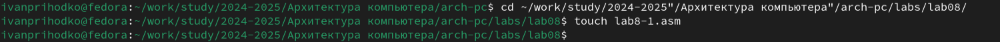

Теперь вставим код из листинга 8.1. Он должен запускать цикл и выводить каждую итерацию число, на единицу меньше предыдущего (рис. 2.2).

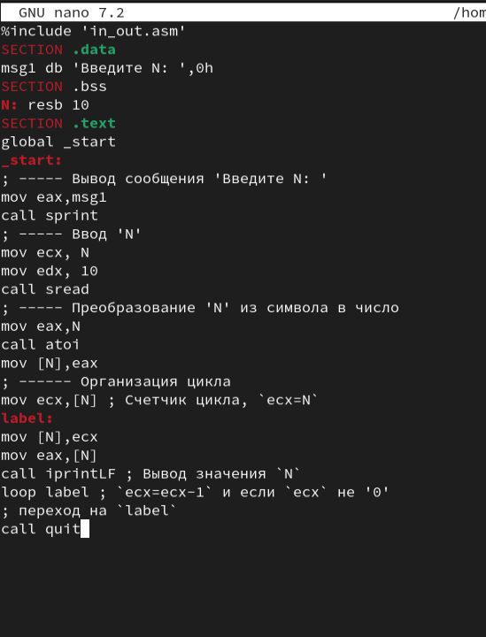

Скопируем файл in_out.asm из предыдущей работы (рис. 2.3).

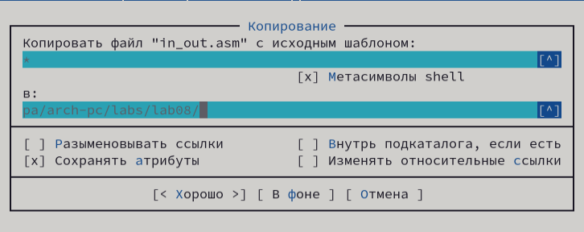

Теперь создадим и запустим файл (рис. 2.4).

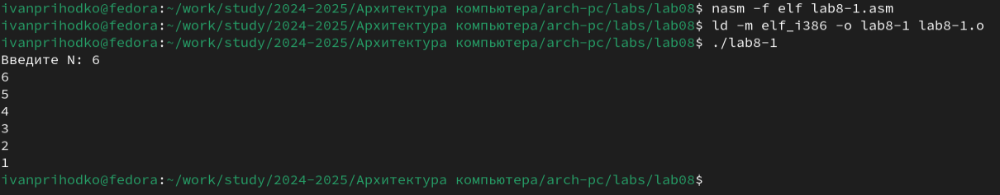

Теперь попробуем изменить код, чтобы в цикле также отнималась единица у регистра ecx (рис. 2.5).

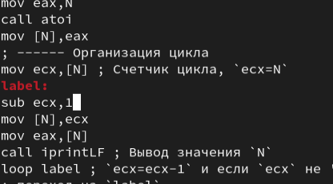

Теперь соберем и запустим файл (рис. 2.6).

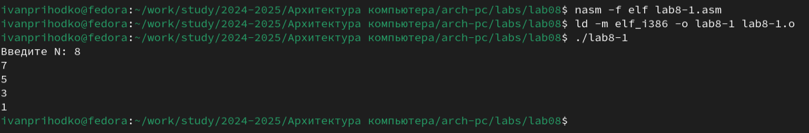

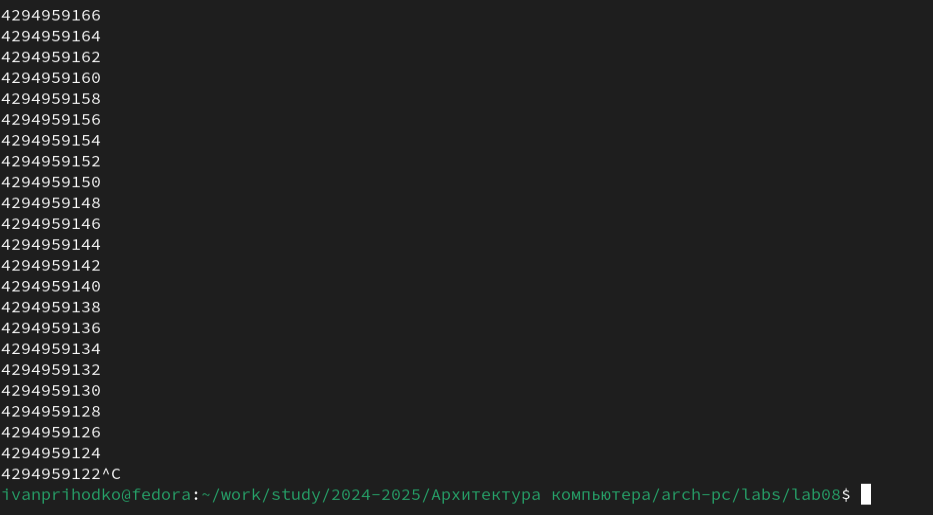

Как видим, цикл выполняется бесконечное количество раз. Это связано с тем, что цикл останавливается в тот момент, когда при проверке ecx равен 0, но он каждое выполнение цикла уменьшается на 2, из-за чего, в случае нечётного числа, никогда не достигнет нуля. Если на вход подать чётное число, цикл прогонится N/2 раз, выводя числа от N-1 до 1. 

Теперь попробуем изменить программу так, чтобы она сохраняла значение регистра ecx в стек (рис. 2.8).

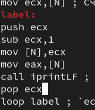

Теперь соберем и запустим файл (рис. 2.9).

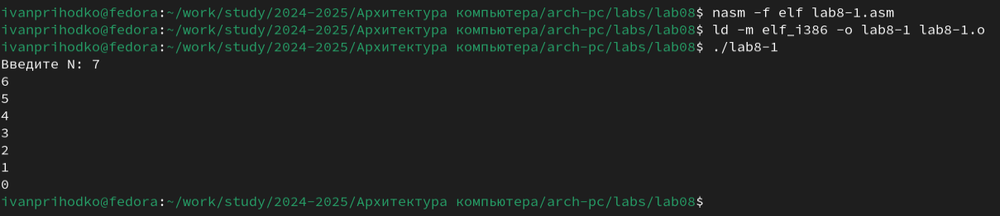

Теперь, программа выводит все числа от N-1 до нуля. Таким образом, число прогонов цикла равно числу N. Создадим второй файл (рис. 2.10).

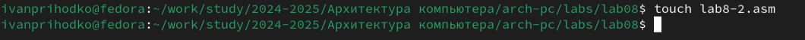

Вставим код из листинга 8.2 (рис. 2.11).

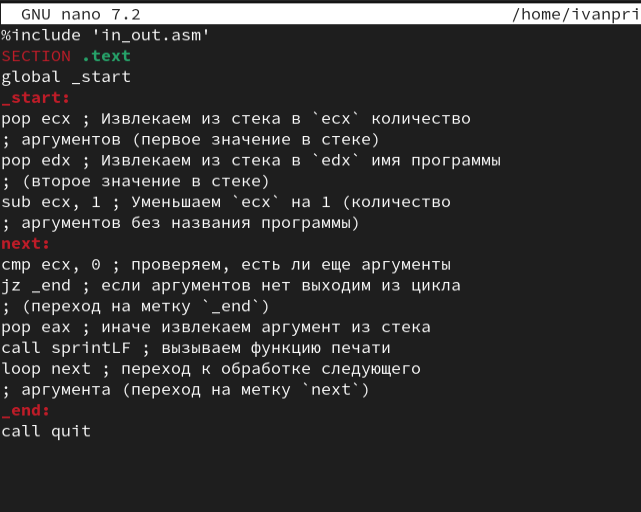

Теперь соберем и запустим файл (рис. 2.12).

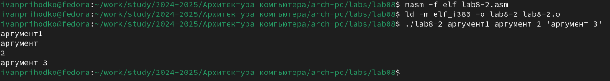

Теперь создадим lab8-3.asm (рис. 2.13).

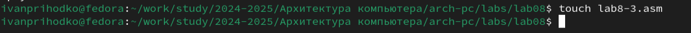

Вставим в него код из листинга 8.3 (рис. 2.14).

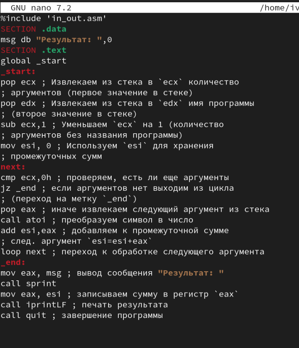

Соберем и запустим файл (рис. 2.15).

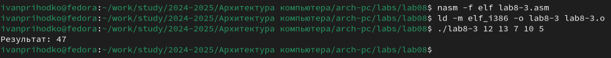

Изменим файл так, чтобы она находила не сумму, а произведение всех аргументов (рис. 2.16).

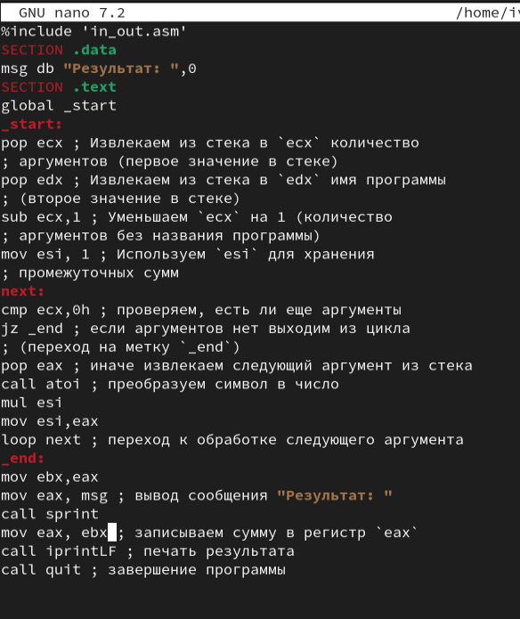

Соберем и запустим файл (рис. 2.17).

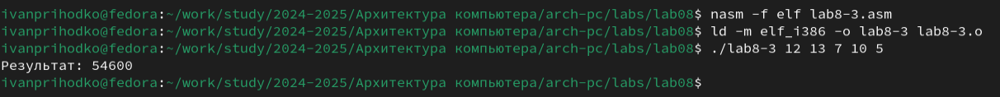

# Выполнение лабораторной работы

Создадим файл для лабораторной работы (рис. 3.1).

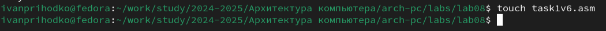

В рамках самостоятельной работы необходимо сделать задание под вариантом 6. Необходимо сложить результаты выполнения функции f(x)=4x-3 для всех введённых аргументов (рис. 3.2).

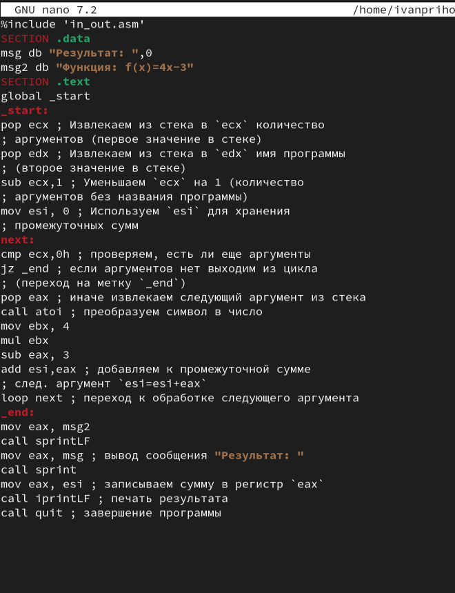

Соберем и запустим файл (рис. 3.3).

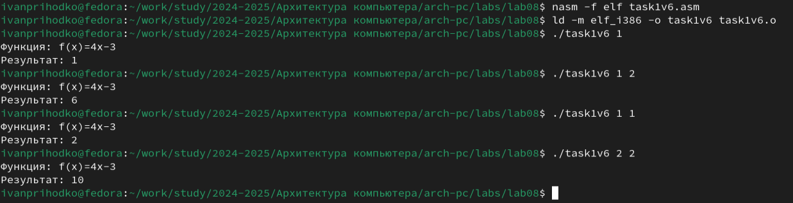

# Выводы

В результате выполнения лабораторной работы были получены навыки работы с циклами и обработкой аргументов из командной строки. Были написаны программы, использующие все вышеописанные аспекты.

