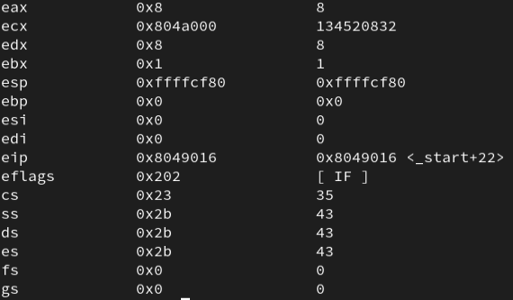
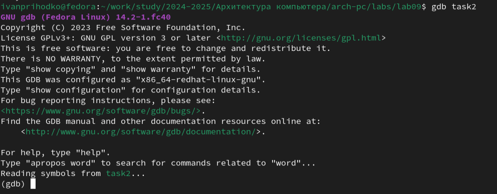

---
## Front matter
title: "Понятие подпрограммы. Отладчик GDB"
subtitle: "Лабораторная работа №9"
author: "Приходько Иван Иванович"

## Generic otions
lang: ru-RU
toc-title: "Содержание"

## Bibliography
bibliography: bib/cite.bib
csl: pandoc/csl/gost-r-7-0-5-2008-numeric.csl

## Pdf output format
toc: true # Table of contents
toc-depth: 2
lof: true # List of figures
lot: true # List of tables
fontsize: 12pt
linestretch: 1.5
papersize: a4
documentclass: scrreprt
## I18n polyglossia
polyglossia-lang:
  name: russian
  options:
	- spelling=modern
	- babelshorthands=true
polyglossia-otherlangs:
  name: english
## I18n babel
babel-lang: russian
babel-otherlangs: english
## Fonts
mainfont: IBM Plex Serif
romanfont: IBM Plex Serif
sansfont: IBM Plex Sans
monofont: IBM Plex Mono
mathfont: STIX Two Math
mainfontoptions: Ligatures=Common,Ligatures=TeX,Scale=0.94
romanfontoptions: Ligatures=Common,Ligatures=TeX,Scale=0.94
sansfontoptions: Ligatures=Common,Ligatures=TeX,Scale=MatchLowercase,Scale=0.94
monofontoptions: Scale=MatchLowercase,Scale=0.94,FakeStretch=0.9
mathfontoptions:
## Biblatex
biblatex: true
biblio-style: "gost-numeric"
biblatexoptions:
  - parentracker=true
  - backend=biber
  - hyperref=auto
  - language=auto
  - autolang=other*
  - citestyle=gost-numeric
## Pandoc-crossref LaTeX customization
figureTitle: "Рис."
tableTitle: "Таблица"
listingTitle: "Листинг"
lofTitle: "Список иллюстраций"
lotTitle: "Список таблиц"
lolTitle: "Листинги"
## Misc options
indent: true
header-includes:
  - \usepackage{indentfirst}
  - \usepackage{float} # keep figures where there are in the text
  - \floatplacement{figure}{H} # keep figures where there are in the text
---

# Цель работы

Ознакомиться с понятием подпрограмм в Ассемблере и научиться использовать подпрограммы на практике. Ознакомиться с отладчиком gdb и научиться использовать его

# Выполнение лабораторной работы

Для начала выполнения работы необходимо создать файл lab9-1.asm (рис. 2.1).

Скопируем файл in_out.asm из директории прошлой работы (рис. 2.2).

Вставим в файл lab9-1.asm код из листинга 9.1 (рис. 2.3).

Соберем и запустим файл (рис. 2.4).

Теперь изменим файл так, чтобы внутри подпрограммы была ещё одна подпрограмма, вычисляющая значение g(x) и чтобы она передавала значение в первую подпрограмму, которая бы уже вычислила значение f(g(x)) (рис. 2.5).

Повторно соберем и запустим программу (рис. 2.6).

Создадим новый файл и вставим в него код из листинга 9.2 (рис. 2.7).

Соберём программу с использованием аргумента -g (рис. 2.9).

Теперь загрузим её в gdb (рис. 2.10).

Создадим брейкпоинт на метке _start с помощью команды break (рис. 2.11).

С помощью команды disassemble дизассемблируем её (рис. 2.12).

Переключим синтаксис вывода на intel и повторно дизассемблируем программу (рис. 2.13).

Включим графическое отображения кода (рис. 2.14).

Включим графическое отображение значений регистров (рис. 2.15).

Выведем информацию о всех брейкпоинтах (рис. 2.16).

Попробуем теперь создать брейкпоинт по адресу (рис. 2.17).

Повторно выведем информацию о брейкпоинтах (рис. 2.18).

Теперь 5 раз выполним команду si для построчного выполнения кода (рис. 2.19-2.23).

Как видим, поменялись значения регистров eax, ecx, edx и ebx. Теперь выведем информацию о значениях регистров (рис. 2.24).

Попробуем вывести значение переменной по имени (рис. 2.26).

Теперь попробуем вывести значение переменной по адресу (рис. 2.27).

Теперь изменим первый символ переменной (рис. 2.28).

А теперь изменим второй символ переменной, уже обратившись по адресу (рис. 2.29).

Теперь изменим несколько символов второй переменной (рис. 2.30).

Теперь попробуем вывести значение регистра в строковом, двоичном и шестнадцатиричном виде (рис. 2.31).

Попробуем теперь изменить значение регистра (рис. 2.32).

Как видим, в регистр записались разные значения. Это связано с тем, что в одном случае мы записываем в него число, а в другом случае - строку. Завершим работу программы (рис. 2.33-2.34).

Скопируем файл из прошлой работы, соберём его и выгрузим в gdb (рис. 2.35).

Создадим брейкпоинт и запустим программу (рис. 2.36).

Теперь выведем значение регистра esp, где хранятся данные о стеке (рис. 2.37).

Теперь выведем значение всех элементов стека (рис. 2.38).

Как видим, для вывода каждого элемента стека нам нужно менять значение адреса с шагом 4. Это связано с тем, что именно с шагом 4 располагаются данные в стеке, ведь под каждый элемент выделяется 4 байта.

# Выполнение задания для самостоятельной работы

Скопируем файл первого задания прошлой самостоятельной работы и перепишем его так, чтобы он использовал для вычисления выражения подпрограмму (рис. 3.1).

Соберем и запустим (рис. 3.2).

Создадим файл второго задания самостоятельной работы (рис. 3.3).

Вставим в него код из листинга 9.3 (рис. 3.4).

Соберем его и запустим (рис. 3.5).

Как видим, код считает значение выражения неправильно. Загрузим его в gdb (рис. 3.6).

Переключим его на синтаксис intel (рис. 3.7).

Включим графическое отображение кода, отображение значений регистров и установим брейкпоинт на _start (рис. 3.8).

И начнём построчно выполнять код (рис. 3.9 - 3.14).

Как видим, мы должны были умножить значение регистра ebx, но умножили регистр eax. Нам необходимо все результаты хранить в регистре eax. Изменим код (рис. 3.15).

Проверим корректность его выполнения (рис. 3.16).

# Выводы

В результате выполнения лабораторной работы были получены представления о работе подпрограмм, а также было реализовано несколько программ, использующих подпрограммы. Также, были получены навыки работы с базовым функионалом gdb, и с помощью gdb была отловлена ошибка в коде программы.
